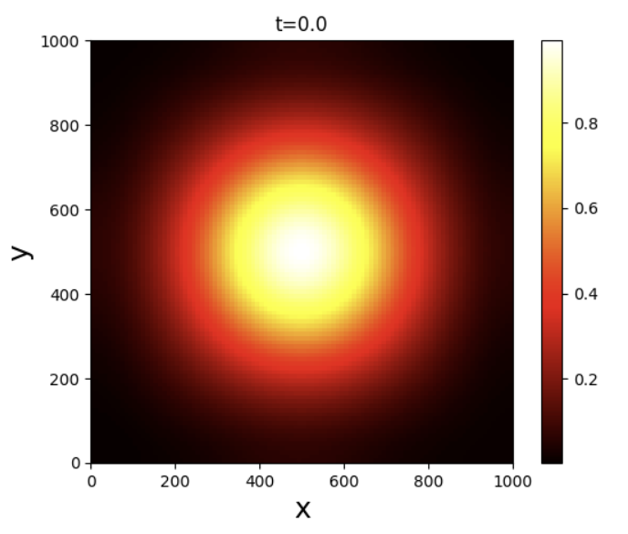
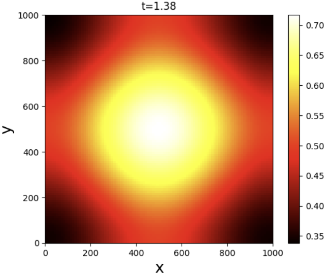
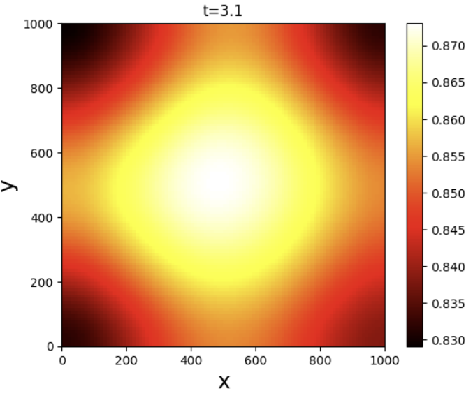

# n-Dimensional PDE solver using Physics-Informed Neural Networks (PINNs) -> README

**Author:** Marti JIMENEZ  
**Date:** 01/08/2023  
**Institution:** INSA (National Institute of Applied Sciences) Toulouse, France  
**License:** Open-source  

## Introduction

This repository contains a Python code to solve n-Dimensional Partial Differential Equations with Physics-Informed Neural Networks. The code leverages TensorFlow, an open-source deep learning library, to build and train the neural network. 

Partial Differential Equations (PDEs) are fundamental in describing physical phenomena like fluid dynamics, heat conduction, and quantum mechanics. In medicine, PDEs are crucial for modeling tumor growth, drug diffusion, and biological processes. Solving complex, high-dimensional PDEs can be challenging, especially when analytical solutions are not feasible. This repository offers an efficient solution using Physics-Informed Neural Networks (PINNs) to solve n-dimensional PDEs.

PINNs can achieve accurate and robust solutions without increasing the complexity exponentially for every dimension added in the PDE like other methods (Finite Difference Method).

## Dependencies

- Python 3.x
- TensorFlow (>=2.0)
- NumPy
- Matplotlib

## Code Structure

The code is organized into several sections, each serving a specific purpose. Below is an overview of the major components:

1. **Dimensions and Variable Boundaries:**

   Specify the number of dimensions (DIMENSIONS) and the boundaries for each variable (BOUNDARIES).
   
2. **Define the PDE, Boundary Conditions, and Initial Conditions:** 

   Set up the PDE, boundary conditions, and initial conditions. The code uses TensorFlow for symbolic differentiation to compute the residuals of the PDE and boundary conditions.

3. **Data Generation:**

   Create the datasets for initial conditions (X_0), boundary conditions (X_b), and PDE collocation points (X_r).

4. **Neural Network Configuration:**

   Set up the neural network architecture using TensorFlow Keras. The code uses a feedforward neural network with a configurable number of hidden layers (NUMBER_HIDDEN_LAYERS) and neurons per layer (NUMBER_NEURONS_PER_LAYER). 

5. **Residuals and Loss Computation:**

   Define functions to calculate the residuals of the PDE (comp_r), initial conditions (comp_i) and boundary conditions (comp_b) using TensorFlow automatic differentiation. The loss function (compute_loss) computes the mean squared error between the predicted and actual residuals.

6. **Model Training:**

   Train the neural network using gradient descent and backpropagation. The code uses the Adam optimizer with piecewise constant decay of learning rate.

7. **Show Solution:**

   Visualize the solution using matplotlib and animating the results for different time steps.

## How to Use

To use the code, follow these steps:

1. Install the required dependencies (TensorFlow, NumPy, Matplotlib).

2. Modify the DIMENSIONS, BOUNDARIES, and other configuration parameters as needed for your specific problem.

3. Define the PDE and initial conditions in the `comp_r` and `comp_i` functions, respectively. Define the Neumann Boundary Condition by changing the NEUMANN_BOUNDARY_CONDITION variable.

4. Run the code to train the model.

    
   **The trained Neural Network will be saved as a .h5 file in the specified path (CHEKPOINT_PATH)**

5. You can then use model.predict() to predict the solution of the PDE at the given point. And you can load a saved model with model.load_weights(CHEKPOINT_PATH)

## Model Checkpoints

The trained model checkpoints are saved during training at specific iterations and can be found in the `CHEKPOINT_PATH` directory. The final trained model is saved as `CHEKPOINT_PATH_ModelTrained.h5`.

## Example

As an example, we are solving the Fisher-KPP equation in 2 Dimensions:

$\frac{\partial u}{\partial t} = D \left(\frac{\partial^2 u}{\partial x^2} + \frac{\partial^2 u}{\partial y^2}\right) + r \cdot u \cdot (1 - u)$

with the Initial Condition $\exp{(-\frac{(x-0.5)^2+(y-0.5)^2}{0.08})}$ and the Neumann Boundary Condition: $\nabla u \cdot n = 0$

where:
- $u = u(t, x, y)$ represents the population density of the species at time $t$ and spatial coordinates $(x, y)$.
- $\frac{\partial u}{\partial t}$ is the time derivative of $u$, representing the rate of change of the population density with time.
- $D$ is the diffusion coefficient, which controls the rate of diffusion or dispersal of the species in space.
- $\frac{\partial^2 u}{\partial x^2}$ and $\frac{\partial^2 u}{\partial y^2}$ are the second partial derivatives of $u$ with respect to $x$ and $y$, respectively, representing the spatial diffusion or spread of the population.
- $r$ is the growth rate of the species, representing how fast the population grows in the absence of spatial constraints.
- $u \cdot (1 - u)$ is the logistic growth term, which introduces a carrying capacity effect, limiting the population growth when the population density approaches 1.

The Fisher-KPP equation is commonly used to model the spread of an advantageous trait or the invasion of a species into a new habitat. It is a classic example of a reaction-diffusion equation with a nonlinear reaction term.

### Predicted Solution
Neural Network: 4 Hidden layers of 20 Neurons

## License

This code is released under an open-source license, allowing users to modify, distribute, and use it freely.

## Acknowledgments

This code is developed by Marti JIMENEZ as part of research conducted at the Laboratory of Pathogen Host Interactions (LPHI) of Montpellier, France. If you find this code useful for your work, we appreciate acknowledgment in your publications.

Feel free to reach out to the author if you have any questions or need further assistance with the code.

## Citation

If you use this code in your research work, please cite the following paper:

[Insert citation for the relevant paper here]
